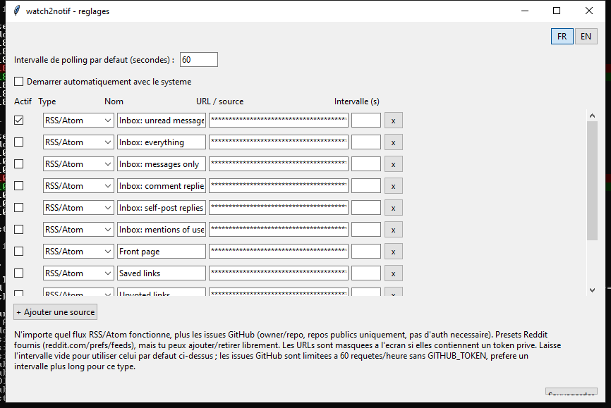

*[English](README.md) | **Français***

# watch2notif

Petit outil desktop qui surveille des sources (flux RSS/Atom, issues
GitHub...) et affiche une notification native et cliquable quand quelque
chose de nouveau apparait. Cross-platform (Windows/Linux/Mac).

Parti d'un besoin de surveiller son inbox Reddit (via les flux RSS prives
de reddit.com/prefs/feeds), puis generalise : n'importe quel flux
RSS/Atom fonctionne, plus les issues GitHub sur les repos publics (pas
d'auth necessaire). Ajouter un nouveau type de source = ajouter un module
dans `providers/`, rien d'autre a toucher.

## Capture d'ecran



## Fonctionnement

- `notifier.py` : boucle de fond, poll les sources activees dans
  `config.json`, chacune avec son propre intervalle, notification
  desktop cliquable (ouvre le lien de la source) sur chaque nouvelle
  entree. Etat "deja vu" garde par source dans `state/`.
- `providers/` : un module par type de source (`rss.py`,
  `github_issues.py`), chacun expose `fetch_entries(source) -> list[Entry]`.
  Ajouter un type de source = ajouter un module ici, rien d'autre ne
  change.
- `settings.py` : panneau de reglage (tkinter, stdlib, aucune dependance
  supplementaire) pour ajouter/retirer des sources, choisir leur type,
  regler leur intervalle de polling individuel, et activer l'autostart.
  Bilingue FR/EN, bascule en haut a droite.
- `notify_backend.py` : backend de notification par OS - `win11toast`
  (Windows, toast WinRT moderne, bon nom d'appli, cliquable), `pync`
  (Mac, via terminal-notifier, cliquable), `plyer` (Linux, pas encore
  cliquable).
- `autostart_manager.py` : active/desactive l'autostart selon l'OS
  (raccourci dans le dossier Demarrage sous Windows, service utilisateur
  systemd sous Linux, launchd sous Mac). Detecte le mode fige
  PyInstaller pour pointer vers le binaire construit plutot que le
  script Python.

## Installation

### Depuis les sources

```bash
pip install -r requirements.txt
cp config.example.json config.json
python settings.py   # ajouter des sources, cocher ce qu'on veut suivre
python notifier.py   # lancer la surveillance
```

### Binaire autonome

Chaque release fournit des bundles pre-construits (Windows/Linux/Mac) sur
la page [Releases](../../releases), sans Python a installer :
`watch2notif-settings` (panneau de reglage) et `watch2notif` (poller de
fond).

## Construire le bundle soi-meme

```bash
python build.py
```

Cree un environnement de construction isole (`build_venv/`) et produit
`dist/watch2notif/` avec les deux executables. Voir
`.github/workflows/release.yml` pour la construction automatisee sur les
trois OS a chaque etiquette `v*`.

## Sources

### RSS/Atom (n'importe quel flux)

N'importe quelle URL RSS/Atom valide fonctionne. Pour Reddit
specifiquement : sur `https://www.reddit.com/prefs/feeds/`, chaque flux
(inbox, front page, saved, upvoted...) a un lien RSS/JSON avec un token
prive dans l'URL. Ce token n'expire pas tant que le mot de passe du
compte ne change pas. Ne pas partager ces URLs : elles donnent un acces
en lecture au contenu prive associe.

L'API Data Reddit classique (OAuth, ce qu'utilise `praw`) exige
desormais un cas d'usage de moderation pour enregistrer une nouvelle
application. Ces flux RSS prives restent une fonctionnalite officielle,
sans ce blocage, suffisante pour un usage personnel de lecture.

### Issues GitHub (repos publics)

Entre `owner/repo` comme source. Utilise l'API REST publique de GitHub,
pas d'authentification necessaire pour les repos publics. Limite a 60
requetes/heure par IP sans token, 5000/heure avec un token (variable
d'environnement `GITHUB_TOKEN`, ex: `gh auth token`). Prefere un
intervalle plus long (quelques minutes) pour ce type de source, pour
rester sous la limite sans token.

## Alternatives existantes

Des lecteurs RSS generalistes (RSS Guard, QuiteRSS...) font deja du
polling de flux avec notifications desktop, mais ne couvrent pas les
sources non-RSS comme l'API issues de GitHub. `watch2notif` reste
minimaliste (pas de lecteur d'articles) et integre l'autostart, les
notifications cliquables, et un petit systeme de providers pour ajouter
des types de sources.

## Licence

GPLv3, voir `LICENSE`.
