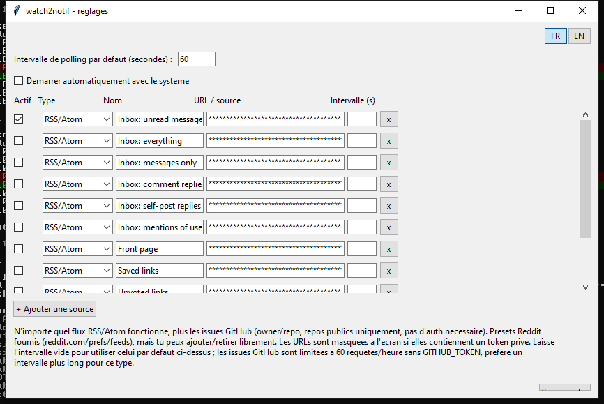
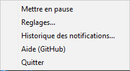
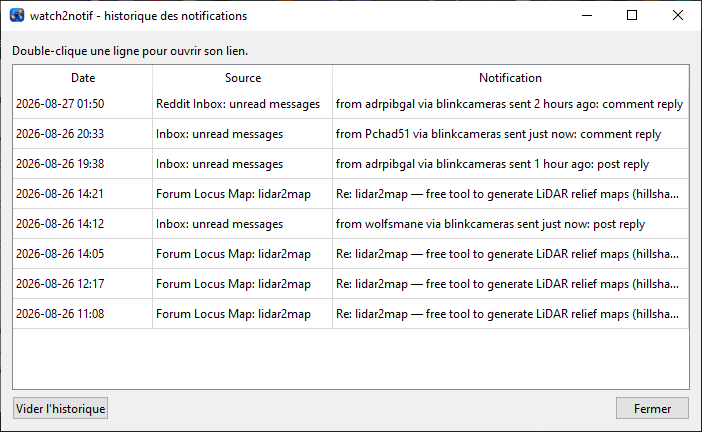

[](README.md)
[](README.fr.md)

[](https://github.com/nico579/watch2notif/releases/latest)

# watch2notif

Application pour Windows, Linux, macOS et Android qui surveille les flux
RSS/Atom, issues GitHub, réponses de discussion, Sponsors et commentaires
YouTube, et affiche une notification native quand une nouveauté apparaît.

Partie d’un besoin de surveiller une inbox Reddit (via les flux RSS privés
de reddit.com/prefs/feeds), puis généralisée : n’importe quel flux
RSS/Atom fonctionne, plus les issues GitHub sur les dépôts publics (sans
authentification), les réponses à une discussion GitHub, Sponsors et les
commentaires d’une vidéo YouTube. Les types de sources utilisent une interface
de provider commune et un registre sur chaque plateforme.

## Captures d’écran





## Fonctionnement

- `notifier.py` : boucle de fond qui interroge les sources activées dans
  `config.json`, chacune à son propre intervalle, et affiche une
  notification pour chaque nouvelle entrée. L’état « déjà vu » de chaque
  source est gardé dans `state/` : les 4 000 identifiants les plus récents,
  plus ceux que la source affiche encore ; une entrée datée qui revient
  après avoir été oubliée est reconnue comme ancienne et n’est pas notifiée
  de nouveau, comme sur Android. `config.json`, `state/` et l’historique
  des notifications vivent dans le dossier de données standard du système
  (`%APPDATA%` sous Windows, dossier XDG sous Linux, Application Support
  sous macOS, via `platformdirs`, voir `data_paths.py`), jamais à côté de
  l’exécutable : une réinstallation ou une reconstruction ne doit jamais
  les effacer. C’est aussi le point d’entrée unique du binaire construit :
  une icône dans la zone de notification (`pystray`, par
  [nico579-commons](https://github.com/nico579/nico579-commons)) au même
  menu que les trois applications sœurs : Ouvrir (la page de
  réglages/historique, dans le navigateur par défaut), Mettre à jour
  quand une version plus récente existe, Redémarrer, Arrêter, et Créer un
  raccourci sur le Bureau. La pause, l’historique et le lien d’aide
  GitHub sont dans la page. watch2notif consulte les releases GitHub une
  fois par heure et ajoute cette entrée de menu, plus une notification
  unique, quand une nouvelle version sort (`update_check.py`). Dans
  l’application empaquetée, la page de réglages propose de l’installer,
  vérifie la taille et le SHA-256 de l’asset, puis remplace le bundle
  après sa fermeture et le redémarre en conservant les réglages et
  l’historique (`self_update.py`). Un checkout des sources n’est jamais
  modifié automatiquement.
- `providers/` : un module par type de source (`rss.py`,
  `github_issues.py`, `github_discussion.py`, `github_sponsors.py`, `youtube_comments.py`),
  chacun expose `fetch_entries(source) -> list[Entry]`.
  Ajouter un type de source demande un module ici et son enregistrement
  dans `providers/__init__.py`.
- `gui/` + `nico579_commons.serveweb` : page de réglages/historique (ajouter
  ou retirer des sources, choisir leur type, régler leur intervalle entre
  5 secondes et une semaine, activer le démarrage automatique dans le
  panneau Réglages, parcourir les 200 dernières notifications envoyées et
  cliquer un titre pour rouvrir son lien), servie en HTTP local (stdlib
  `http.server`, aucun framework) et ouverte dans le navigateur par défaut,
  même architecture que les projets jumeaux lidar2map et blink2video.
  Bilingue FR/EN : français quand la langue d’affichage du système est le
  français, anglais sinon, bascule en haut à droite. Accessible depuis l’entrée
  Ouvrir de l’icône, ou avec `notifier.py --settings`.
- `notify_backend.py` : notification native par système, `win11toast`
  (Windows, toast WinRT moderne, bon nom d’application, cliquable), `pync`
  (macOS, via terminal-notifier, cliquable), `plyer` (Linux, pas encore
  cliquable).
- `autostart_manager.py` : active ou désactive le démarrage automatique
  selon le système (raccourci dans le dossier Démarrage sous Windows,
  service utilisateur systemd sous Linux, agent launchd sous macOS). En
  mode figé PyInstaller, il pointe vers le binaire construit plutôt que
  vers le script Python.

## Installation

### Depuis les sources

Python 3.12 est la version testée par la CI, et `requirements.txt` fige
chaque dépendance avec son empreinte pour elle. Un environnement virtuel
les tient à l’écart du reste du système :

```bash
python -m venv .venv
.venv/bin/pip install -r requirements.txt          # Windows : .venv\Scripts\pip
.venv/bin/python notifier.py   # le premier lancement ouvre la page de réglages dans le navigateur
```

Options utiles : `--settings` ouvre la page de l’instance en cours (ou en
démarre une), `--no-tray` fonctionne sans icône (Ctrl+C pour arrêter).

### Binaire autonome

Chaque release fournit des bundles préconstruits (Windows/Linux x86_64,
macOS arm64) sur
la page [Releases](https://github.com/nico579/watch2notif/releases/latest),
sans Python à installer. Extraire l’archive et conserver le dossier
`watch2notif` complet, y compris `_internal`, ou le bundle `.app` macOS.
Lancer `watch2notif.exe`, `watch2notif` ou l’application macOS démarre la
surveillance ; la page de réglages/historique s’ouvre depuis son icône
(Ouvrir) ou avec `watch2notif --settings`.

Lorsqu’une mise à jour compatible est publiée, la page de réglages affiche
un bandeau avant tout téléchargement. « Télécharger et installer », ou
Mettre à jour dans le menu de l’icône, prépare et valide d’abord le
nouveau bundle complet ; watch2notif ne se ferme que lorsque le programme
de remplacement externe est prêt, puis redémarre sur la nouvelle version.
Si la préparation, le remplacement ou le redémarrage échoue, l’installation
courante est conservée ou restaurée. Une plateforme non prise en charge
renvoie vers la page de la release.

### Clés d’API sur PC

Certaines sources demandent une clé : `GITHUB_TOKEN` (obligatoire pour les
discussions et Sponsors, facultative pour les issues), `YOUTUBE_API_KEY` et,
pour le filtre IA, `ANTHROPIC_API_KEY`. Sur PC, elles sont lues dans les
variables d’environnement et jamais écrites dans `config.json` : un export
de la configuration ou une capture de la page ne peut pas les divulguer.
Les sections plus bas expliquent comment obtenir chacune.

watch2notif lit ces variables une seule fois, au démarrage. Après en avoir
posé une, utiliser **Redémarrer** dans le menu de l’icône ; sinon l’instance
en cours continue sans elle.

- **Windows** : `setx GITHUB_TOKEN "ghp_..."` dans un terminal (ou
  Propriétés système, Variables d’environnement). `setx` ne vaut que pour
  les programmes lancés ensuite, y compris le raccourci de démarrage.
- **Linux** : le démarrage automatique lance watch2notif comme service
  utilisateur systemd, qui ne lit ni `~/.bashrc` ni `~/.profile`. Mettre les
  variables dans `~/.config/environment.d/watch2notif.conf` (une ligne
  `NOM=valeur` chacune), puis fermer et rouvrir la session.
- **macOS** : le démarrage automatique passe par un agent launchd, qui ne lit
  pas non plus le profil du shell. `launchctl setenv GITHUB_TOKEN ghp_...`
  rend une variable visible des applications lancées ensuite, jusqu’au
  prochain redémarrage.

### Application Android

Télécharger **watch2notif-android.apk** dans la
[dernière release GitHub](https://github.com/nico579/watch2notif/releases/latest),
puis ouvrir le fichier sur le téléphone et autoriser son installation.
L’APK signé et les bundles desktop sont construits et testés sur GitHub Actions,
puis publiés ensemble. L’AAB Android est également disponible pour une boutique.
La signature reste identique entre les releases ; une ancienne installation
debug doit être désinstallée avant de passer à l’APK de release.

L’application native fonctionne directement sur Android 8.0 ou plus récent,
avec les mêmes types de sources, un historique et un filtre Claude facultatif
par source. Autoriser les notifications pour recevoir les alertes. La
surveillance automatique planifie les vérifications toutes les 15 minutes,
en respectant les intervalles plus longs ; Android peut les retarder.
Le mode rapide utilise leurs intervalles avec une notification permanente.
Il maintient le processeur disponible écran éteint et consomme davantage de
batterie. **Réglages → Surveillance en arrière-plan → Autoriser la surveillance
en arrière-plan** ouvre l’autorisation Android permettant de conserver le
réseau en veille profonde. Le mode rapide peut reprendre après une interruption
de son processus par Android ou à la réouverture d’une session demandée.
Une pause ou un arrêt volontaire annule cette reprise ; une erreur ou une limite
de durée Android demande une relance explicite depuis Sources. Le dernier cycle
et le bilan des accès sont visibles dans les réglages. Android 15+ peut l’arrêter
après six heures en arrière-plan : un
message indique comment le relancer et le mode automatique reste planifié.
Les restrictions Android ou du fabricant et une perte de connexion peuvent
encore retarder les vérifications ; un arrêt forcé suspend la surveillance
jusqu’à la réouverture de l’application.
Voir le [guide Android](android/README.md) pour les réglages et les limites.

**Réglages → Mises à jour de l’application** recherche les releases GitHub,
télécharge l’APK signé et ouvre l’installateur Android. L’application vérifie
aussi à son ouverture, avec un cache en mémoire de six heures. Le téléchargement
utilise les adresses HTTPS officielles ; l’empreinte SHA-256, le package, la
version et la signature de l’application installée sont vérifiés. Android peut
d’abord demander d’autoriser les installations depuis watch2notif. Les sources
et clés chiffrées sont conservées lors d’une mise à jour avec la même signature.
Si Android redémarre l’application pendant cette autorisation, télécharger
de nouveau l’APK avant de l’installer.

Après l’import, **Réglages → Identifiants des API → Tester les accès** effectue
un smoke test de chaque source activée et de la clé Claude configurée. Il utilise
le registre habituel des providers et distingue les réussites, clés manquantes,
refus d’authentification, problèmes de droits/quota et délais réseau dépassés.
Les sources désactivées sont ignorées. Le test conserve les états de surveillance
et l’historique des notifications. Le test Claude envoie un court message de
diagnostic et utilise l’API payante Anthropic, sans contenu des sources. Un accès
réussi à une source ne prouve pas que Claude fonctionne. **Vérifier maintenant**
compte aussi séparément les réussites et les échecs ; les cartes des sources
affichent la date du dernier accès réussi.

Les clés GitHub, YouTube et Claude peuvent aussi être saisies directement dans
**Réglages → Identifiants des API**, puis enregistrées. Sur PC, utiliser les
variables d’environnement décrites plus haut. Le transfert QR importe ces clés
du PC dans le stockage chiffré du téléphone.

### Partager les réglages du PC vers Android

1. Installer les versions PC et Android de la même release, puis connecter
   les deux appareils au même réseau local.
2. Sur le PC, cliquer **Envoyer vers le téléphone** dans l’onglet **Flux**.
   Vérifier l’interface et l’adresse affichées : choisir le Wi-Fi ou l’Ethernet
   du réseau du téléphone, plutôt qu’une interface VPN ou virtuelle.
3. Sur Android, ouvrir **Réglages → Scanner le QR du PC**, autoriser la caméra,
   scanner le QR et confirmer l’import.

Les sources, leurs intervalles, leur activation, les consignes Claude et les
clés `GITHUB_TOKEN`, `YOUTUBE_API_KEY` et `ANTHROPIC_API_KEY` du processus PC
sont transférés avec un chiffrement authentifié AES-256-GCM. La clé de
déchiffrement vient uniquement du QR. Le code expire après deux minutes,
ne fonctionne qu’une fois et le PC referme le port après usage ou annulation.
Le serveur n’écoute que pendant cette fenêtre de transfert ; aucun service cloud
ni redirection de port Internet n’est nécessaire.

Si le téléphone ne joint pas le PC, vérifier le réseau Wi-Fi commun et l’absence
d’isolation des clients (réseau invité). Windows peut classer le Wi-Fi comme
**Public** et bloquer le programme. Dans la fenêtre du QR, **Autoriser le transfert
local** demande une autorisation administrateur Windows et ajoute une règle
pour le seul exécutable watch2notif, en TCP, sur l’adresse PC sélectionnée et
depuis le sous-réseau local (profils Privé/Public). Cette règle reste enregistrée,
sans modifier le profil réseau ni désactiver le pare-feu ; le port continue de
se fermer après usage, annulation ou deux minutes. Avec ce consentement explicite,
les blocages TCP généraux du seul exécutable sur le profil Public sont désactivés
et remplacés par cette permission limitée. Les blocages UDP, Privé, Domaine,
gérés ou plus spécifiques restent en place et peuvent empêcher le transfert.
Windows demande directement le consentement administrateur, sans ouvrir de
console PowerShell. L’ancien QR est fermé pendant cette demande ; un nouveau
QR apparaît après vérification de la règle. Une annulation ou un échec de lecture,
de création ou de vérification de la règle reste affiché au-dessus du QR.
Scanner le nouveau QR après autorisation.
Android utilise le réseau Wi-Fi/Ethernet pour cette seule requête, sans proxy,
et distingue un délai dépassé, une connexion refusée, un statut HTTP et un QR expiré.

Android affiche immédiatement la progression de la réception, indépendamment
des vérifications de sources en cours. La réception est limitée à 30 secondes
au total. La progression, les erreurs et la confirmation d’import résistent à
une rotation de l’écran ; le contenu du QR et les clés reçues restent en mémoire
et ne sont jamais enregistrés dans l’état sauvegardé de l’écran. Une annulation
écarte les réglages reçus. Après un redémarrage du processus, générer un nouveau QR.
Le PC indique si une connexion locale l’a atteint et si la réponse chiffrée a
été envoyée. Ces compteurs bornés restent en mémoire, sans journaliser les adresses
des clients, les corps des requêtes, les codes ou les clés.

L’import remplace les sources du téléphone et établit une référence initiale
silencieuse. L’historique reste propre à chaque appareil. Les clés Android sont
chiffrées dans le stockage privé de l’application avec Android Keystore.
Ne pas diffuser le QR : il permet d’accéder à la configuration et aux clés.

**Importer/Exporter un JSON** reste disponible sur les deux appareils pour
les sources et les consignes Claude, sans clés API ni historique. Les URLs
RSS privées peuvent toutefois contenir un token : privilégier le QR pour
les transférer. Sur le PC, cliquer **Sauvegarder** après un import JSON.

## Construction et tests sur GitHub

GitHub Actions construit les bundles Windows, Linux et macOS ainsi que l’APK
et l’AAB Android à chaque étiquette `v*`. Les tests Python sur les trois OS,
les tests Android/Robolectric, Android Lint et le lancement de contrôle des
exécutables conditionnent la publication. Des tests sur émulateurs Android 11
et 15 vérifient aussi le vrai service rapide en veille profonde écran éteint,
les notifications, la reprise après mort du processus sans doublons, l’arrêt
volontaire et le timeout Android 15. Ils utilisent un flux RSS local fictif et
des clés factices ; leur réussite est obligatoire pour publier. **Tester les
accès** sur le téléphone valide les accès aux vraies sources.
Aucun binaire construit localement n’est téléversé dans les releases.

Les pull requests et les changements de `master` exécutent également la CI.
Voir [.github/workflows/ci.yml](.github/workflows/ci.yml),
[android.yml](.github/workflows/android.yml),
[android-background.yml](.github/workflows/android-background.yml) et
[release.yml](.github/workflows/release.yml).

## Sources

### RSS/Atom (n’importe quel flux)

N’importe quelle URL RSS/Atom valide fonctionne. Pour Reddit en
particulier : sur `https://www.reddit.com/prefs/feeds/`, chaque flux
(inbox, front page, saved, upvoted...) a un lien RSS/JSON avec un token
privé dans l’URL. Ne pas partager ces URLs : elles donnent un accès
en lecture au contenu privé associé. Leur disponibilité et leurs accès
dépendent de Reddit ; si un flux ne fonctionne plus, vérifier son URL
actuelle dans les réglages des flux du compte.

Les forums bâtis sur SMF (Simple Machines Forum, un moteur de forum PHP
courant) ont des flux RSS et Atom, mais il faut vérifier ce qu’ils couvrent.
Les anciennes versions acceptent `?action=.xml;type=rss2;topic=<id>.0` ajouté
à l’URL `index.php` du forum (`<id>` est le numéro de l’URL du sujet,
`index.php?topic=<id>.<offset>`) et ne renvoient que ce fil. SMF 2.1 non :
le forum Locus Map (SMF 2.1.7) n’annonce que des flux de toute la rubrique
(`board=<n>`, dans les balises `<link rel="alternate">` de la page) et ignore
`topic=`, si bien qu’un message d’un autre sujet a été notifié comme une
réponse. Ouvrez l’URL du flux dans un navigateur et regardez les numéros
`topic=` des liens des entrées. Si plusieurs apparaissent, ajoutez à la
source une consigne de **filtre IA** (voir plus bas) qui ne garde que votre
fil, par exemple « Seulement les messages du fil intitulé « Re: nom de mon
outil » », ou utilisez le bouton « Notifier » du forum sur le sujet, qui
envoie un e-mail à chaque réponse.

### Issues GitHub (dépôts publics)

Saisir `owner/repo` comme source. L’API REST publique de GitHub ne demande
pas d’authentification pour les dépôts publics, mais limite à 60
requêtes/heure par IP sans token, 5000/heure avec (variable
d’environnement `GITHUB_TOKEN` sur PC, ou token GitHub dans les réglages
Android). Si le CLI `gh` est déjà installé et connecté, `gh auth token` en
affiche un ; sinon, en créer un à la main sur GitHub.com : menu avatar ->
Settings -> Developer settings -> Personal access tokens -> Tokens
(classic) -> Generate new token (classic). Aucune case à cocher pour un
accès en lecture seule aux dépôts publics : le token doit seulement
exister, pour authentifier la requête et lever la limite par IP. Préférer
un intervalle de quelques minutes pour ce type de source, afin de rester
sous la limite sans token.

### Réponses à une discussion GitHub

Saisir `owner/repo#numero` comme source (le numéro après `/discussions/`
dans l’URL). watch2notif surveille ce fil et signale les nouveaux
commentaires et réponses, parmi les 100 commentaires les plus récents et
les 100 réponses les plus récentes de chacun. Contrairement aux issues,
les Discussions n’ont aucune API REST : ce provider passe par l’API
GraphQL de GitHub, qui refuse les requêtes anonymes même sur un dépôt
public. La clé `GITHUB_TOKEN` est donc obligatoire, pas un simple bonus
de limite de débit (même variable que pour les issues GitHub, voir
plus haut pour l’obtenir).

### GitHub Sponsors

Saisir un identifiant GitHub (le sien ou celui d’une organisation) comme
source. Les nouveaux parrainages passent par l’API GraphQL, comme les
réponses de discussion, donc `GITHUB_TOKEN` est requis là aussi, avec en
plus le scope `read:user` : c’est lui qui expose un identifiant stable
pour un sponsor resté anonyme (son profil est caché, mais le parrainage
lui-même garde un identifiant distinct, si bien qu’un deuxième sponsor
anonyme n’est jamais confondu avec le premier). L’événement est rare
comparé à une réponse de discussion, d’où un intervalle par défaut plus
long.

### Commentaires YouTube

Saisir une URL de vidéo (`watch?v=`, `youtu.be/`, `/embed/`, `/shorts/` ou
`/live/`) ou un identifiant de 11 caractères comme source. watch2notif
surveille cette vidéo et signale les nouveaux commentaires de premier
niveau et leurs réponses visibles. YouTube expose un flux Atom pour les
nouvelles vidéos d’une chaîne, mais aucun pour les commentaires d’une
vidéo : ce provider passe donc par l’API YouTube Data v3. Il faut une clé
d’API gratuite : Google Cloud Console -> APIs & Services -> activer
"YouTube Data API v3" -> Credentials -> Create API key, puis définir la
variable `YOUTUBE_API_KEY` sur PC, ou saisir la clé API YouTube dans les
réglages Android. Le provider actuel lit jusqu’à 100 fils récents et les
réponses incluses dans le résultat ; il ne récupère pas tout leur historique.
Une vérification réussie fait deux appels, soit 2 unités de quota
([videos.list](https://developers.google.com/youtube/v3/docs/videos/list),
[commentThreads.list](https://developers.google.com/youtube/v3/docs/commentThreads/list)).
Le quota par défaut est de [10 000 unités par projet et par jour](https://developers.google.com/youtube/v3/getting-started#quota) :
tenir compte de toutes les vidéos surveillées et des deux appareils pour
choisir les intervalles.

## Filtre IA (facultatif)

Certaines sources sont trop larges pour être utiles telles quelles. Une
recherche Reddit sur "local storage" dans un subreddit de caméras remonte
les personnes à qui votre outil rendrait service, mais aussi des plaintes
de facturation et des photos de caméras neuves. Les mots seuls ne font pas
la différence ; la lecture du message, si.

Sur PC, chaque source a un bouton **Filtre IA** ; sur Android, modifier le
champ **Filtre IA** de la source. Décrire, en langage courant, les entrées
qui méritent une notification, par exemple : « Les questions de personnes
qui veulent garder ou télécharger leurs clips Blink sans abonnement. Pas
les plaintes de facturation, pas les problèmes de détection de
mouvement. » Avant de notifier une nouvelle entrée, watch2notif envoie son
titre et son texte à Claude Haiku 5.5 avec cette consigne, et ne notifie
que celles qu’il juge pertinentes, avec en tête de la notification une
phrase qui dit pourquoi. Les autres sont mémorisées comme vues et ne
reviennent jamais. Une zone vide veut dire : pas de filtre.

Il faut une clé d’API Anthropic dans la variable d’environnement
`ANTHROPIC_API_KEY` sur PC, ou dans les réglages Android pour la clé Claude
([console Anthropic](https://console.anthropic.com)). L’API se paie à l’usage,
à part de tout abonnement Claude ; le coût dépend du nombre et de la longueur
des messages (un message courant a consommé environ 400 tokens en entrée et
60 à 90 en sortie, moins d’un centième de centime aux tarifs d’octobre 2026).
Si la clé manque, que l’API ne répond pas ou que le modèle refuse de classer
un message, watch2notif notifie quand même et le dit dans la notification :
une entrée n’est jamais perdue en silence.

### Rattraper d’anciens messages (PC, depuis les sources)

Le filtre ne juge que les entrées nouvelles. Pour le faire passer une fois sur
ce qu’une source a montré par le passé, par exemple trois mois d’un flux de
recherche r/ :

```bash
python tools/rattrapage_flux.py --simuler                 # compte et chiffre, sans appel payant
python tools/rattrapage_flux.py                           # 90 jours de r_blinkcameras_questions
python tools/rattrapage_flux.py --flux CLÉ --jours 30     # une autre source, une autre période
```

`CLÉ` est la `key` de la source dans `config.json`. Le script lit la source,
garde les entrées de la période, juge chacune avec la consigne du filtre IA de
la source (ou `--consigne`) et écrit un rapport Markdown : les entrées
retenues, celles qui ont été écartées (pour repérer un message écarté à tort)
et celles qui avaient déjà été notifiées. Il ne notifie rien et ne touche pas
à `state/` : le suivi horaire continue comme avant. Une page de recherche
Reddit contient 100 entrées, ce qui couvre souvent un trimestre sur un petit
subreddit ; Reddit répond HTTP 429 aux clients anonymes qui enchaînent
plusieurs requêtes en quelques secondes, donc le lancer une fois et attendre
quelques minutes avant de le relancer.

## Ajouter un type de source

Un provider est un module dans `providers/` qui expose deux choses :

- `LABEL` : nom affiché dans la liste des types de source de la page de
  réglages.
- `fetch_entries(source) -> list` : prend la chaîne de source saisie par
  l’utilisateur (une URL, `owner/repo`...) et renvoie la liste actuelle
  des entrées. Chaque entrée doit exposer `.id` et `.get(key, default)`,
  la forme dont `notifier.py` a besoin pour détecter les nouvelles
  entrées et lire `title`, `author`, `link`, `summary`.

Deux constantes facultatives : `DEFAULT_INTERVAL_SECONDS`, l’intervalle que
la page propose pour une nouvelle source de ce type (60 s sinon ; le
prévoir large pour une API limitée en débit), et `SOURCE_HINT`, un exemple
de source attendue, gardé comme documentation (la page desktop ne
l’affiche pas).

Si les données brutes sont déjà des objets avec `.id`/`.get()` (comme
les entrées feedparser dans `rss.py`), les renvoyer directement. Sinon,
envelopper chaque élément dans `providers.base.Entry(id, title, author,
link, summary, created)`, comme le fait `github_issues.py` pour l’API JSON
de GitHub. `created` (une date ISO 8601) est facultatif mais utile : il
permet à `notifier.py` de distinguer une entrée vraiment nouvelle d’une
ancienne qui refait surface.

Enregistrer ensuite le module dans le dict `PROVIDERS` de
`providers/__init__.py` (clé = type interne, valeur = le module).
`notifier.py` et la page de réglages (`gui/`) récupèrent tout provider
enregistré via `PROVIDERS`, sans branchement spécifique. Le seul autre
endroit à toucher est `config_transfer.py`, qui valide l’export JSON et le
transfert par QR : y ajouter le type dans `KINDS`, son intervalle par
défaut et une vérification du format de sa source.

Android conserve ce principe avec une interface Java commune, une classe par
provider et un registre dans [ProviderRegistry.java](android/app/src/main/java/io/github/nico579/watch2notif/ProviderRegistry.java).
Le registre fournit les types disponibles, les libellés, les indications de
saisie et les intervalles ; le moteur de surveillance et l’interface restent
communs. Chaque provider valide sa source et gère ses propres besoins de clés.
Pour ajouter un type sur les deux plateformes, fournir les implémentations
Python et Java avec le même identifiant `kind`, puis ajouter sa compatibilité
au format de transfert. Android exécute son implémentation native.

## Alternatives existantes

Des lecteurs RSS généralistes (RSS Guard, QuiteRSS...) interrogent déjà
des flux avec notifications, mais ne couvrent pas les sources hors RSS
comme l’API des issues GitHub. `watch2notif` reste minimaliste (pas de
lecteur d’articles) et intègre le démarrage automatique, les notifications
cliquables et un petit système de providers pour ajouter des types de
sources.

## Licence

GPLv3, voir `LICENSE`.
