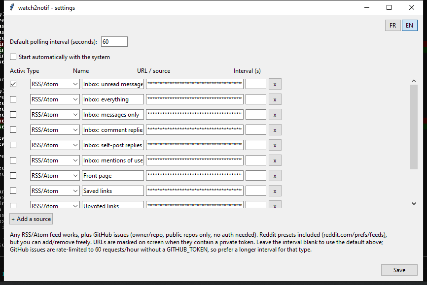

***English** | [Français](README.fr.md)*

# watch2notif

Small desktop tool that watches sources (RSS/Atom feeds, GitHub issues...)
and fires a native, clickable notification whenever something new shows
up. Cross-platform (Windows/Linux/Mac).

Started as a Reddit inbox watcher (via Reddit's private RSS feeds,
reddit.com/prefs/feeds), then generalized: any RSS/Atom feed works, plus
GitHub issues polling for public repos (no auth needed). New source types
are added as a `providers/` module, nothing else to touch.

## Screenshot



## How it works

- `notifier.py`: background loop, polls the sources enabled in
  `config.json`, each on its own interval, fires a desktop notification
  (clickable, opens the source's link) for each new entry. Per-source
  "already seen" state kept in `state/`.
- `providers/`: one module per source type (`rss.py`, `github_issues.py`),
  each exposing `fetch_entries(source) -> list[Entry]`. Adding a new
  source type means adding a module here, nothing else changes.
- `settings.py`: settings panel (tkinter, stdlib, no extra dependency) to
  add/remove sources, pick their type, set per-source polling interval,
  and toggle autostart with the system. Bilingual FR/EN, toggle top-right.
- `notify_backend.py`: notification backend per OS — `win11toast`
  (Windows, modern WinRT toast, correct app name, clickable), `pync`
  (Mac, via terminal-notifier, clickable), `plyer` (Linux, not clickable
  yet).
- `autostart_manager.py`: enables/disables autostart depending on the OS
  (shortcut in the Startup folder on Windows, systemd user service on
  Linux, launchd on Mac). Detects PyInstaller's frozen mode to point at
  the built binary instead of the Python script.

## Installation

### From source

```bash
pip install -r requirements.txt
cp config.example.json config.json
python settings.py   # add sources, check what you want to watch
python notifier.py   # start watching
```

### Standalone binary

Each release ships pre-built bundles (Windows/Linux/Mac) on the
[Releases](../../releases) page, no Python required:
`watch2notif-settings` (settings panel) and `watch2notif` (background
poller).

## Building the bundle yourself

```bash
python build.py
```

Creates an isolated build environment (`build_venv/`) and produces
`dist/watch2notif/` with both executables. See `.github/workflows/release.yml`
for the automated build across the three OSes on every `v*` tag.

## Sources

### RSS/Atom (any feed)

Any valid RSS/Atom URL works. For Reddit specifically: on
`https://www.reddit.com/prefs/feeds/`, each feed (inbox, front page,
saved, upvoted...) has an RSS/JSON link with a private token in the URL.
This token doesn't expire unless you change your account password.
Don't share these URLs: they grant read access to the associated private
content.

Reddit's classic Data API (OAuth, what `praw` uses) now requires a
moderation use case to register a new application. These private RSS
feeds remain an official feature, without that restriction, and are
enough for personal read-only use.

### GitHub issues (public repos)

Enter `owner/repo` as the source. Uses GitHub's public REST API, no
authentication needed for public repos. Rate-limited to 60 requests/hour
per IP without a token, 5000/hour with one (set the `GITHUB_TOKEN`
environment variable, e.g. from `gh auth token`). Prefer a longer
per-source interval for this type (a few minutes) to stay under the
unauthenticated limit.

## Existing alternatives

General-purpose RSS readers (RSS Guard, QuiteRSS...) already do feed
polling with desktop notifications, but don't cover non-RSS sources like
GitHub's issues API. `watch2notif` stays minimal (no article reader) and
bundles autostart, clickable notifications, and a small provider system
to add new source types.

## License

GPLv3, see `LICENSE`.
