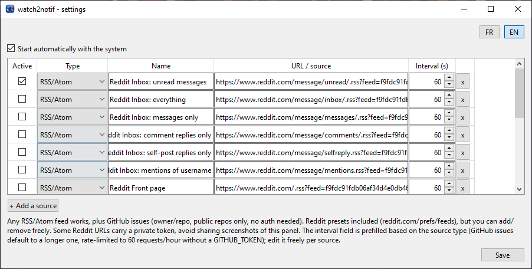
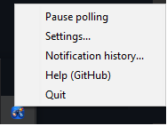
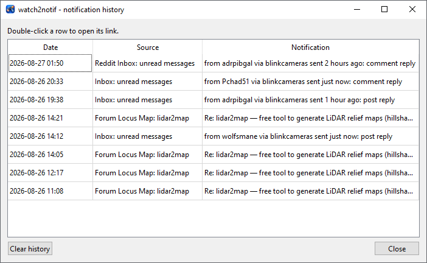

[](README.md)
[](README.fr.md)

[](https://github.com/nico579/watch2notif/releases/latest)

# watch2notif

An app for Windows, Linux, macOS and Android that watches RSS/Atom feeds,
GitHub issues, discussion replies, Sponsors and YouTube comments, and fires
a native notification whenever something new shows up.

Started as a Reddit inbox watcher (via Reddit's private RSS feeds,
reddit.com/prefs/feeds), then generalized: any RSS/Atom feed works, plus
GitHub issues polling for public repos (no auth needed), GitHub
discussion replies, Sponsors and YouTube video comments. New source types
use a common provider interface and registry on each platform.

## Screenshots





## How it works

- `notifier.py`: background loop, polls the sources enabled in
  `config.json`, each on its own interval, fires a desktop notification
  for each new entry. Per-source
  "already seen" state kept in `state/`. `config.json`, `state/` and the
  notification history live in the OS's standard per-user data directory
  (`%APPDATA%` on Windows, XDG data dir on Linux, Application Support on
  Mac, via `platformdirs`, see `data_paths.py`), never next to the
  executable: a reinstall or rebuild must never wipe them. Also the single
  entry point of
  the built binary: a system tray icon (`pystray`, through
  [nico579-commons](https://github.com/nico579/nico579-commons)) with the
  same menu as its three sibling apps: Open (the settings/history page, in
  the default browser), "Update to x.y" when a newer version is out,
  Restart, Stop, and "Create a Desktop shortcut". Pausing, the history and
  the GitHub help link live in the page. It checks the GitHub releases
  page once an hour and adds that menu entry + one desktop notification when
  a newer version is out. In
  a packaged app, the settings page offers to install it, verifies the
  published asset's size and SHA-256, then replaces the bundle after
  shutdown and restarts it while preserving settings and notification
  history (`update_check.py`, `self_update.py`). A source checkout is
  never modified automatically.
- `providers/`: one module per source type (`rss.py`, `github_issues.py`,
  `github_discussion.py`, `github_sponsors.py`, `youtube_comments.py`), each exposing
  `fetch_entries(source) -> list[Entry]`. Adding a new source type means
  adding a module here and registering it in `providers/__init__.py`.
- `gui/` + `nico579_commons.serveweb`: settings/history page (add/remove sources,
  pick their type, set per-source polling interval between 5 seconds and
  a week, toggle autostart in the Settings panel, browse the last 200
  notifications actually sent and click a title to reopen its link)
  served on local HTTP (stdlib `http.server`, no
  framework) and opened in the system's default browser — same
  architecture as the sibling projects, lidar2map and blink2video.
  Bilingual FR/EN, toggle top-right. Reachable from the tray's "Open"
  item, or with `notifier.py --settings`.
- `notify_backend.py`: notification backend per OS — `win11toast`
  (Windows, modern WinRT toast, correct app name, clickable), `pync`
  (Mac, via terminal-notifier, clickable), `plyer` (Linux, not clickable
  yet).
- `autostart_manager.py`: enables/disables autostart depending on the OS
  (shortcut in the Startup folder on Windows, systemd user service on
  Linux, launchd on Mac). Detects PyInstaller's frozen mode to point at
  the built binary instead of the Python script.

## Installation

### From source

Python 3.12 is the version tested by CI, and `requirements.txt` pins every
dependency with its hash for it. A virtual environment keeps them apart
from the rest of your system:

```bash
python -m venv .venv
.venv/bin/pip install -r requirements.txt          # Windows: .venv\Scripts\pip
.venv/bin/python notifier.py   # first run opens the settings page in your browser
```

Useful flags: `--settings` opens the page of the running instance (or
starts one), `--no-tray` runs without a tray icon (Ctrl+C to stop).

### Standalone binary

Each release ships pre-built bundles (Windows/Linux x86_64, macOS arm64) on the
[Releases](https://github.com/nico579/watch2notif/releases/latest) page,
with no Python installation required. Extract the archive and keep the complete
`watch2notif` folder together, including `_internal`, or the macOS `.app` bundle.
Run `watch2notif.exe`, `watch2notif`, or the macOS app to start watching; open the settings/history page
from its tray icon ("Open") or with `watch2notif --settings`.

When a compatible update is published, the settings page shows a banner
before downloading anything. "Download and install", or "Update to x.y"
in the tray menu, prepares and
validates the whole new bundle first; watch2notif closes only when the
external updater is ready, then restarts on the new version. If
preparation, replacement, or restart fails, the current installation is
kept or restored. Unsupported platforms fall back to the release page.

### API keys on desktop

Some sources need a key: `GITHUB_TOKEN` (required for discussions and
Sponsors, optional for issues), `YOUTUBE_API_KEY` and, for the AI filter,
`ANTHROPIC_API_KEY`. On desktop they are read from environment variables
and never written to `config.json`, so a config export or a screenshot of
the page cannot leak them. The sections below explain how to get each one.

watch2notif reads these variables once, when it starts. After setting one,
use **Restart** in the tray menu, otherwise the running instance keeps
working without it.

- **Windows**: `setx GITHUB_TOKEN "ghp_..."` in a terminal (or System
  Properties, Environment Variables). `setx` only affects programs started
  afterwards, including the autostart shortcut.
- **Linux**: autostart runs watch2notif as a systemd user service, which
  does not read `~/.bashrc` or `~/.profile`. Put the variables in
  `~/.config/environment.d/watch2notif.conf` (one `NAME=value` per line),
  then log out and back in.
- **macOS**: autostart goes through a launchd agent, which does not read
  your shell profile either. `launchctl setenv GITHUB_TOKEN ghp_...` makes a
  variable visible to apps started afterwards, until the next reboot.

### Android app

Download **watch2notif-android.apk** from the
[latest GitHub release](https://github.com/nico579/watch2notif/releases/latest),
then open it on your phone and allow installation. Signed Android APKs and
desktop bundles are built and tested on GitHub Actions and published together.
An Android AAB is also available for store distribution. Releases retain the
same signing key; uninstall any older debug installation before installing
the release APK.

The native app runs directly on Android 8.0 or newer, with the same source
types, notification history and an optional Claude filter per source. Allow
notifications to receive alerts. Automatic monitoring schedules checks every
15 minutes, respecting longer source intervals; Android may delay them.
Fast mode uses their configured intervals with a persistent
notification and keeps the CPU available while the screen is off, using more
battery. **Settings → Background monitoring → Allow background monitoring**
opens Android’s battery permission so network access can continue during deep
sleep. Fast mode can resume after Android kills its process, or when reopening
a previously requested session. Pausing or stopping it clears that request;
an error or Android time limit requires an explicit restart from Sources.
The last fast cycle and access counts are visible in Settings. Android 15+ can stop fast mode
after six background hours; a visible warning explains how to restart it, and
automatic checks remain scheduled. Android and manufacturer restrictions or
lost connectivity can still delay checks; force stop suspends monitoring until
the app is reopened.
See the [Android guide](android/README.md) for settings and limitations.

**Settings → App updates** checks GitHub releases, downloads the signed APK
and opens the Android installer. The app also checks when opened, with a
six-hour in-memory cache. Downloads use official HTTPS endpoints and are
checked against the release SHA-256, package, version and installed signing
certificate. Android may first ask you to allow installation from watch2notif.
If Android restarts the app during that permission step, download the APK
again, then install it.
Sources and encrypted keys are retained when upgrading with the same signature.

After importing, use **Settings → API credentials → Test access** for a smoke
test of every enabled source and the configured Claude key. It uses the normal
provider registry and shows successes, missing keys, authentication failures,
permissions/quota failures and network timeouts separately. Disabled sources
are skipped. The test preserves monitoring state and notification history.
The Claude check sends one short diagnostic message and uses the paid Anthropic
API; it does not send source content. A successful source fetch alone does not
prove that Claude is working. **Check now** also reports successes and failures
separately, and source cards show their last successful access.

You can also enter GitHub, YouTube and Claude keys directly in **Settings →
API credentials**, then save them. On desktop, use the corresponding environment
variables described in [API keys on desktop](#api-keys-on-desktop). The QR transfer imports those desktop credentials
into the phone’s encrypted storage.

### Transfer desktop settings to Android

1. Install the desktop and Android apps from the same release and connect
   both devices to the same local network.
2. On the PC, click **Send to phone** in the **Feeds** tab.
   Check the displayed interface and address: choose the Wi-Fi or Ethernet
   connected to the phone's network rather than a VPN or virtual interface.
3. On Android, open **Settings → Scan the PC QR**, allow camera access,
   scan the QR and confirm the import.

Sources, intervals, enabled states, Claude instructions and the desktop
process's `GITHUB_TOKEN`, `YOUTUBE_API_KEY` and `ANTHROPIC_API_KEY` are
transferred using authenticated AES-256-GCM encryption. The decryption key
comes only from the QR. Its code expires after two minutes, works once and
the PC closes the port after use or cancellation. The server only listens during
this transfer window; no cloud service or Internet port forwarding is required.

If the phone cannot reach the PC, check the shared Wi-Fi and client isolation
(guest networks). Windows may classify Wi-Fi as **Public** and block the app.
In the QR dialog, **Allow local transfer** requests Windows administrator consent
and adds a TCP rule for the watch2notif executable only, at the selected PC address,
from the local subnet (Private/Public profiles). The rule remains saved without
changing the network profile or disabling the firewall; the port still closes
after use, cancellation or two minutes. With this explicit consent, general
Public-only TCP block rules for this executable are disabled and replaced by
the scoped permission. UDP, Private, Domain, managed or more specific block rules
are left in place and may still prevent transfer. Windows requests administrator
consent directly, without opening a PowerShell console. The old QR is closed
while consent is pending; a fresh QR appears only after the rule is verified.
Cancellation or a failure to read, create or verify the rule stays visible above
the QR. Scan the new QR after permission is granted. Android uses
Wi-Fi/Ethernet for this request only, without a proxy, and distinguishes timeouts,
connection refusal, HTTP status and expired QR codes.

Android displays reception progress immediately, independently of ongoing source
checks. Reception has a 30-second overall deadline. Progress, errors and import
confirmation survive screen rotation; QR contents and received keys stay in
memory and are never written to saved screen state. Cancelling discards the
received settings. After a process restart, generate a new QR.
The PC reports whether any local connection reached it and whether the encrypted
response was sent. These bounded counters are kept in memory without logging
addresses of peers, request bodies, codes or keys.

Import replaces the phone's sources and establishes a silent initial
baseline. Each device keeps its own history. Android credentials are
encrypted in private app storage using Android Keystore. Keep the QR private:
it grants access to configuration and credentials.

**Import/Export JSON** remains available on both devices for sources and Claude
instructions, without API keys or history. Private RSS URLs can still contain
tokens: use the QR to transfer those. On the PC, click **Save** after a JSON import.

## Builds and tests on GitHub

GitHub Actions builds Windows, Linux and macOS bundles plus the Android APK
and AAB on each `v*` tag. Publication requires Python tests on all three OSes,
Android/Robolectric tests, Android Lint and executable smoke checks to pass.
Emulator tests on Android 11 and 15 also verify the real fast service in deep
sleep with the screen off, notification delivery, recovery after process death
without duplicates, manual stop and the Android 15 background timeout.
These tests use a local RSS fixture and dummy credentials; they are required
for publication. Real source access is checked with **Test access** on the phone.
No locally compiled binary is uploaded to releases.

Pull requests and changes to `master` also run CI. See
[.github/workflows/ci.yml](.github/workflows/ci.yml),
[android.yml](.github/workflows/android.yml),
[android-background.yml](.github/workflows/android-background.yml) and
[release.yml](.github/workflows/release.yml).

## Sources

### RSS/Atom (any feed)

Any valid RSS/Atom URL works. For Reddit specifically: on
`https://www.reddit.com/prefs/feeds/`, each feed (inbox, front page,
saved, upvoted...) has an RSS/JSON link with a private token in the URL.
Don't share these URLs: they grant read access to the associated private
content. Their availability and access are controlled by Reddit; if a feed
stops working, check its current URL in your account’s feed settings.

Forums built on SMF (Simple Machines Forum, a common PHP forum engine)
expose a native per-topic RSS feed, no plugin needed: append
`?action=.xml;type=rss2;topic=<id>.0` to the forum's `index.php` URL,
where `<id>` is the numeric topic ID found in the topic's own URL
(`index.php?topic=<id>.<offset>`). It only returns posts in that thread,
so it works as a "notify me on new replies to my post" watcher.

### GitHub issues (public repos)

Enter `owner/repo` as the source. Uses GitHub's public REST API, no
authentication needed for public repos. Rate-limited to 60 requests/hour
per IP without a token, 5000/hour with one (set the `GITHUB_TOKEN`
environment variable on desktop, or GitHub token in Android settings).
If the `gh` CLI is already installed and logged
in, `gh auth token` prints one; otherwise create one manually on
GitHub.com: avatar menu -> Settings -> Developer settings -> Personal
access tokens -> Tokens (classic) -> Generate new token (classic). No
scope needs to be checked for read-only access to public repos, the
token only needs to exist to authenticate the request and lift the
per-IP limit. Prefer a longer per-source interval for this type (a few
minutes) to stay under the unauthenticated limit.

### GitHub discussion replies

Enter `owner/repo#number` as the source (the number after `/discussions/`
in the URL). Watches one Discussion thread and reports new top-level
comments and replies, among the 100 most recent comments and the 100 most
recent replies to each. Unlike GitHub issues, Discussions have no REST
endpoint at all: this goes through GitHub's GraphQL API instead, which
refuses anonymous requests even on a public repo. The `GITHUB_TOKEN`
credential is therefore required, not just a rate-limit
booster (same variable as GitHub issues, see above for how to obtain
one).

### GitHub Sponsors

Enter your GitHub login (or an organization's) as the source. Watches new
sponsorships through the GraphQL API like GitHub discussion replies, so
`GITHUB_TOKEN` is required there too, but with the extra `read:user` scope on top of the
usual ones: that scope is what exposes a stable ID for a sponsor who chose
to stay anonymous (their profile is hidden, but the sponsorship itself
still gets a distinct ID, so a second anonymous sponsor is never mistaken
for the first). A rare event compared to a discussion reply, so the
default interval is longer.

### YouTube comments

Enter a video URL (`watch?v=`, `youtu.be/`, `/embed/`, `/shorts/` or
`/live/`) or a bare 11-character video ID as the source.
Watches one video and reports new top-level comments and their visible
replies. YouTube exposes an Atom feed for a channel's new uploads, but
none for comments on a video, so this goes through the YouTube Data API
v3 instead. Requires a free API key: Google Cloud Console -> APIs &
Services -> enable "YouTube Data API v3" -> Credentials -> Create API
key, then set `YOUTUBE_API_KEY` on desktop or the YouTube API key in Android
settings. The current provider fetches up to 100 recent threads and the
replies included in that response; it does not fetch complete reply histories.
A successful poll makes two calls, costing 2 quota units
([videos.list](https://developers.google.com/youtube/v3/docs/videos/list),
[commentThreads.list](https://developers.google.com/youtube/v3/docs/commentThreads/list)).
The default allowance is [10,000 units per project per day](https://developers.google.com/youtube/v3/getting-started#quota):
account for all watched videos and both devices when choosing intervals.

## AI filter (optional)

Some sources are too broad to be useful as they are. A Reddit search for
"local storage" on a camera subreddit brings up the people who could use
your tool, but also billing complaints and pictures of new cameras. Words
alone cannot tell them apart; reading the message can.

On desktop, each source has an **AI filter** button; on Android, edit the
source’s **AI filter** field. Describe, in plain words, which entries deserve
a notification, for example: "Questions from people who want to keep or download their Blink
clips without a subscription. Not billing complaints, not motion detection
problems." Before notifying a new entry, watch2notif sends its title and
text to Claude Haiku 4.5 with your instructions, and only notifies the ones it
judges relevant, with a one-line reason at the start of the notification.
The others are remembered as seen and never sent again. An empty box means
no filtering.

It needs an Anthropic API key in the `ANTHROPIC_API_KEY` environment
variable on desktop, or the Claude key in Android settings
([Anthropic Console](https://console.anthropic.com)). The API is billed per
use, separately from any Claude subscription; cost depends on message volume
and length. If the key is missing or the API cannot answer,
watch2notif notifies anyway and says so in the notification: an entry is
never dropped silently.

## Adding a source type

A provider is a module in `providers/` exposing two things:

- `LABEL`: display name shown in the settings panel's source-type list.
- `fetch_entries(source) -> list`: takes the source string the user
  entered (a URL, `owner/repo`...) and returns the current list of
  entries. Each entry needs `.id` and `.get(key, default)`, the shape
  `notifier.py` relies on to detect new entries and pull `title`,
  `author`, `link`, `summary`.

Two optional constants: `DEFAULT_INTERVAL_SECONDS`, the interval the page
proposes for a new source of this type (60 s otherwise; keep it generous
for a rate-limited API), and `SOURCE_HINT`, an example of the expected
source string, kept as documentation (the desktop page does not show it).

If the underlying data already comes as objects with `.id`/`.get()`
(like feedparser entries in `rss.py`), return them directly. Otherwise,
wrap each item in `providers.base.Entry(id, title, author, link,
summary, created)`, as `github_issues.py` does for GitHub's JSON API.
`created` (an ISO 8601 date) is optional but useful: it lets
`notifier.py` tell a genuinely new entry from an old one resurfacing.

Then register the module in `providers/__init__.py`'s `PROVIDERS` dict
(key = internal kind, value = the module). `notifier.py` and the settings
page (`gui/`) pick up any registered provider through `PROVIDERS`, with no
per-provider branching. The one other place to touch is
`config_transfer.py`, which validates the JSON export and the QR transfer:
add the kind to `KINDS`, its default interval and a check of its source
format.

Android follows the same design with a common Java interface, one class per
provider and a registry in [ProviderRegistry.java](android/app/src/main/java/io/github/nico579/watch2notif/ProviderRegistry.java).
The registry supplies available types, labels, input hints and intervals;
the polling engine and UI remain shared. Each provider validates its source
and handles its own credential requirements. To add a type on both platforms,
provide Python and Java implementations using the same `kind` identifier,
then add support for that type to the transfer format. Android runs its native
implementation.

## Existing alternatives

General-purpose RSS readers (RSS Guard, QuiteRSS...) already do feed
polling with desktop notifications, but don't cover non-RSS sources like
GitHub's issues API. `watch2notif` stays minimal (no article reader) and
bundles autostart, clickable notifications, and a small provider system
to add new source types.

## License

GPLv3, see `LICENSE`.
